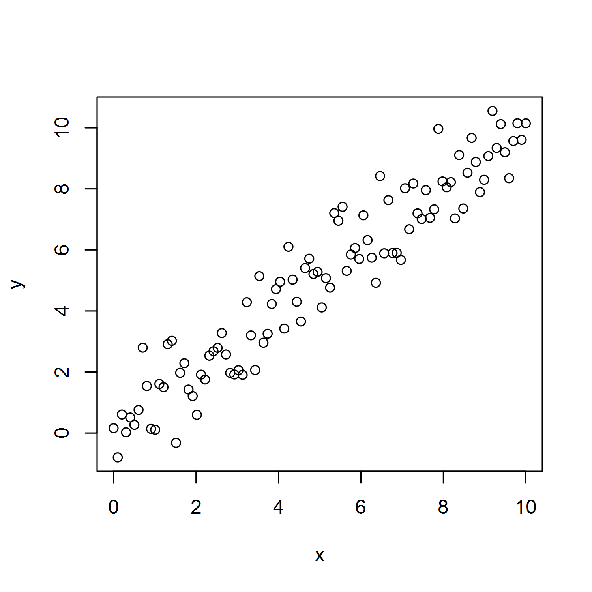
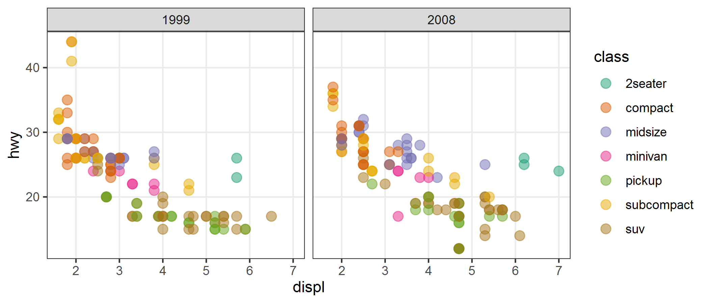
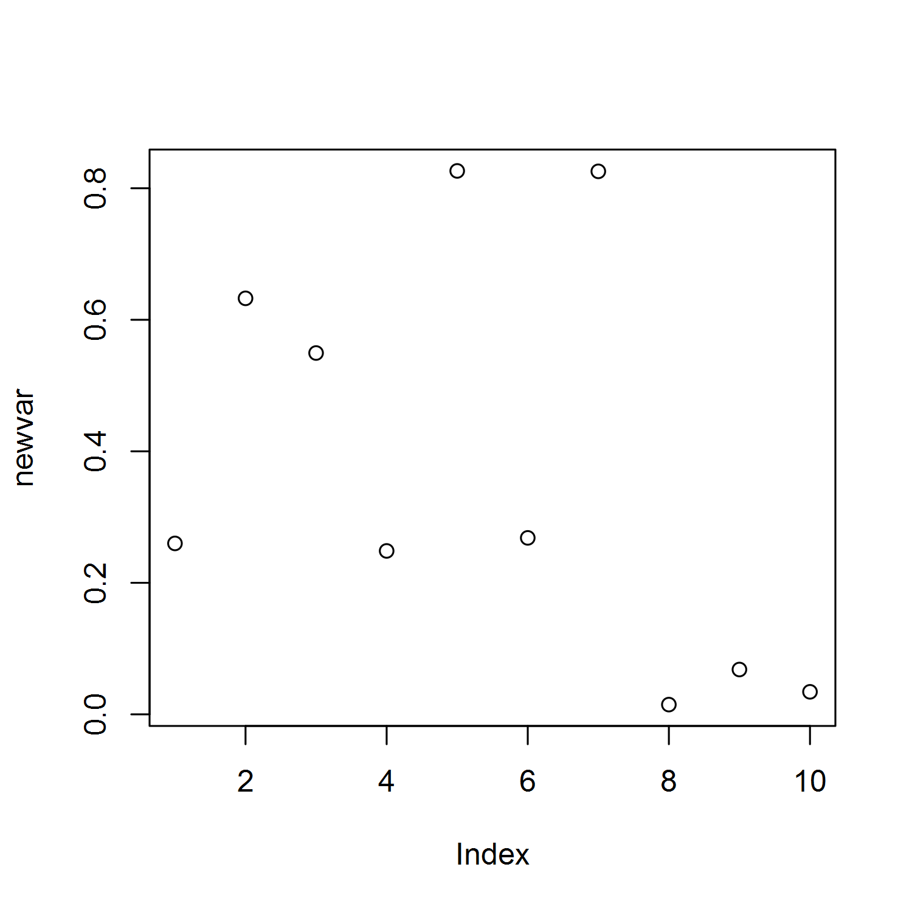

Test-Driving `knitr::read_chunk()` to Include External Script Chunks in
an RMarkdown Document
================
Eric Buhle
2019-04-30 (updated 2021-04-18)

-   [Read chunks](#read-chunks)
-   [Child script 1](#child-script-1)
    -   [Create a data frame](#create-a-data-frame)
    -   [Make a plot](#make-a-plot)
    -   [How to fit a linear model](#how-to-fit-a-linear-model)
-   [Child script 2](#child-script-2)
    -   [Fun with `ggplot2`](#fun-with-ggplot2)
    -   [Chunk with inputs from
        RMarkdown](#chunk-with-inputs-from-rmarkdown)

This demo follows a helpful [blog
post](http://zevross.com/blog/2014/07/09/making-use-of-external-r-code-in-knitr-and-r-markdown/)
by Zev Ross that shows how to import code chunks from an external script
into an RMarkdown document. Also see
[here](https://rpubs.com/thaufas/450838) for some more creative usage.

RMarkdown is great, but IMO it is unsuitable as an environment for code
development, especially for complex analyses. The formatting and
interwoven text are distracting and make re-running code a hassle; the
chunk tool buttons take up screen real estate and the auto-line wrapping
is the enemy of legibility; debugging is a real PITA; and I *hate* the
inline presentation of figures and output when running interactively. R
scripts are superior in all these respects. Until now, my strategy has
been to copy-paste code chunks from a script into an RMarkdown document,
a hacky approach with obvious drawbacks. Usually I end up tweaking and
refining the code in the .Rmd (as opposed to doing it in the script and
having to remember to copy-paste it again) and so the two documents get
out of sync.

The “externalization” strategy shown here offers the best of both
worlds:

-   The flexibility and interactivity of R scripts for code development
-   The power of RMarkdown as a format for literate programming and
    sharing the results of analyses

# Read chunks

First, right after the `setup` chunk, we call `knitr::read_chunk()` to
ingest the code chunks from one or more scripts. (This part is crucial:
we can read chunks from as many “child” scripts as we want, so long as
the chunk names don’t conflict!) Typically we would use `echo = FALSE`
to read in the script’s chunks silently. Note that the code is not
executed at this point; it is just made available to be invoked in
subsequent chunks. (BTW, the [RMarkdown
hieroglyphics](https://yihui.org/en/2017/11/knitr-verbatim-code-chunk/)
needed to produce the following verbatim RMarkdown code chunk is far
more esoteric than code externalization. On the upside, it apparently
makes the aforementioned chunk tool buttons vanish throughout the
document.)

    ```{r read_chunk, echo=FALSE}
    read_chunk(here("chunk_test1.R"))
    read_chunk(here("chunk_test2.R"))
    ```

Let’s see what’s in these external scripts. This is `chunk_test1.R`:

    ## @knitr variables_xy
    x <- seq(0, 10, length = 100)
    y <- x + rnorm(100)
    dat <- data.frame(x = x, y = y)
    head(dat)

    ## @knitr plot_xy
    plot(x,y)

    ## @knitr
    # Here is some code that is not part of a knitr chunk
    # (apparently prefacing the unused chunk with an empty knitr chunk label works;
    # we might also use a label like "unused" for all such chunks, which does not
    # create a conflict unless the chunks are invoked, in which case the last one is used)
    hist(x)

    ## @knitr lm_xy
    lmxy <- lm(y ~ x, data = dat)
    summary(lmxy)

    ## @knitr
    # And some more code that is not part of a knitr chunk
    Sys.time()

Note the special **knitr** comment syntax `## @knitr chunk_name` that
demarcates a new chunk. As the regular comments (preceded by `#`)
helpfully explain, the empty `## @knitr` can be used to delimit the end
of a chunk followed by some lines we don’t want to use in the RMarkdown
(for example, verbose comments that are redundant with the body text).

Here is `chunk_test2.R`:

    ## @knitr ggplot2_demo
    library(ggplot2)

    ggplot(mpg, aes(displ, hwy)) + 
      geom_point(aes(color = class), size = 3, alpha = 0.5) + scale_color_brewer(palette = "Dark2") + 
      theme_bw() + theme(panel.grid.minor = element_blank()) + facet_wrap(. ~ year)

    ## @knitr needs_external_input
    print(newvar)
    plot(newvar)

The chunk `needs_external_input`, counterintuitively, needs external
input. Specifically, `newvar` has not been assigned, so those lines as
written would throw an error. We are going to assign `newvar` in an
RMarkdown chunk and “pass” it to `needs_external_input`. We’ll also see
if the results update when we reassign `newvar` and invoke the external
chunk again, and whether the behavior differs for the `print()` and
`plot()` statements.

# Child script 1

## Create a data frame

The RMarkdown chunk

    ```{r variables_xy}
    ```

produces this:

``` r
x <- seq(0, 10, length = 100)
y <- x + rnorm(100)
dat <- data.frame(x = x, y = y)
head(dat)
```

              x          y
    1 0.0000000 -0.3679264
    2 0.1010101  0.7355091
    3 0.2020202  1.6520385
    4 0.3030303 -0.6536073
    5 0.4040404  0.3091286
    6 0.5050505 -1.1355101

## Make a plot

This time we’ll use `echo = FALSE` to suppress the code.

    ```{r plot_xy, fig.height=5, fig.width=5, out.width = "40%", echo = FALSE}
    ```



## How to fit a linear model

The next chunk shows how to fit a linear model to `y` as a function of
`x`, but doesn’t actually do so (`eval = FALSE`). RMarkdown:

    ```{r lm_xy, eval = FALSE}
    ```

Result:

``` r
lmxy <- lm(y ~ x, data = dat)
summary(lmxy)
```

# Child script 2

Now we’ll use a chunk from the second script, entirely unrelated to the
first.

## Fun with `ggplot2`

The RMarkdown syntax

    ```{r ggplot2_demo, fig.width=7, fig.height=3, out.width="75%"}
    ```

does this, for whatever reason:

``` r
library(ggplot2)

ggplot(mpg, aes(displ, hwy)) + 
  geom_point(aes(color = class), size = 3, alpha = 0.5) + scale_color_brewer(palette = "Dark2") + 
  theme_bw() + theme(panel.grid.minor = element_blank()) + facet_wrap(. ~ year)
```



## Chunk with inputs from RMarkdown

Can we invoke an external chunk that relies on objects defined here in
the RMarkdown itself? Let’s find out. First we assign a variable
`newvar` with a chunk label foreshadowing that we may want to do this
again.

    ```{r assign_newvar1}
    newvar <- 1:10
    ```

``` r
newvar <- 1:10
```

Then we call a chunk that prints its contents and plots it with the
default method.

    ```{r needs_external_input1, fig.height=5, fig.width=5, out.width = "40%"}
    <<needs_external_input>>
    ```

That produces the echoed R code followed by the results of the `print()`
and `plot()` calls, respectively:

``` r
print(newvar)
```

     [1]  1  2  3  4  5  6  7  8  9 10

``` r
plot(newvar)
```


And what if we modify `newvar` and then call the summary chunk again,
using different chunk labels to avoid a conflict? The output is:

    ```{r assign_newvar2}
    newvar <- runif(10,0,1)
    ```

``` r
newvar <- runif(10,0,1)
```

    ```{r needs_external_input2, fig.height=5, fig.width=5, out.width = "40%"}
    <<needs_external_input>>
    ```

``` r
print(newvar)
```

     [1] 0.87617457 0.82253903 0.22407018 0.78569712 0.42350704 0.02986831
     [7] 0.91914623 0.71563321 0.99980845 0.19719154

``` r
plot(newvar)
```



This works, but the plot call **only** works if we use the
`<<chunk_name>>` syntax as opposed to the `{r chunk_name}` syntax. Both
are described in the Zev Ross post linked above. If we use the latter,
the plots are identical and both use the last-defined value of `newvar`.
I don’t understand why, but it must be something about how the output
from the .Rmd code chunks are knitted together. The `<<chunk_name>>`
syntax produces an “unexpected token” warning next to the chunk in the
editor window, which is annoying, but it gives the correct plots.
